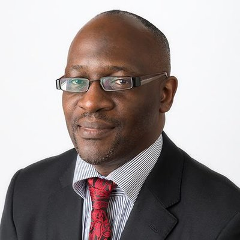

- [Dr Andrew D Kiberu](#kiberu)\\
- [Dr Raj Tota](#tota)
## Dr Andrew D Kiberu {#kiberu}

### SPECIAL INTERESTS
- Adult Medical Oncology\\
- Geriatric Oncology

Dr Andrew Kiberu is an Australian-based health professional and completed fellowship training with the Royal Australasian College of Physicians as a Geriatrician (Aged Care Specialist), in 2009 and as a Medical Oncologist (Cancer Specialist), in 2010. He practices adult medical and geriatric oncology at Fiona stanley hospital in Perth, Kalgoorlie Regional hospital and at St John of God Hospital in Bunbury.

Dr Kiberu undertook medical training overseas and in Western Australia has since graduating in 2009, been a Consultant Geriatrician and/or Medical Oncologist at  Royal Perth Hospital, Swan District hospital, Sir Charles Gairdner hospital, Hollywood Hospital, St John of God Hospitals in Subiaco, Bunbury and Geraldton, Peel Health Campus Mandurah, Geraldton Regional hospital, Kalgoorlie Regional hospital and Shenton hospital, Joondalup. As a specialist at a tertiary cancer centre, he participates in clinical research programs and clinical trials as well as teaching medical students and training junior doctors as well as GPs and nurses.

His previous and current areas of specialisation include Geriatric Oncology, Uro-oncology, Skin and Melanoma, Lung cancers and Gastrointestinal and Neuroendocrine tumours.

Dr Kiberu is a member of ASCO, COSA, MOGA, PCPA, ESMO, ENETS, IASLC, and SIOG.

Dr Kiberu has been providing oncology services to Bunbury since 2010 and he consults at St John of God Bunbury Hospital, every week on Wedsdays and Thursdays.

### Current hospital affiliations
- Fiona Stanley hospital\\
- Kalgoorlie Regional hospital\\
- St John of God hospital, Bunbury 

### Qualifications
- Fellowship of the Royal Australasian College of Physicians
    - Geriatric Medicine (2009)
    - Medical Oncology (2010)
- Bachelor of Medicine, Bachelor of Surgery, 1997.

# Dr Raj Tota {#tota}

Dr Tota is a medical Oncologist currently providing locum consultant services to COGMO. He obtained his medical oncology training in New Zealand and Western Australia and has worked as a consultant medical oncologist in Western Australia and Tasmania. In addition to Bunbury, he is currently working with St John of God hospital Murdoch, Icon Cancer Centre Rockingham, St John of God hospital Midland and at the new Genesis Cancer Centre in Mandurah due to open in August 2019.

### Qualifications
- MBBS J.J.M Medical College India 2000
- AMC Australia 2012
- FRACP Australia 2012
